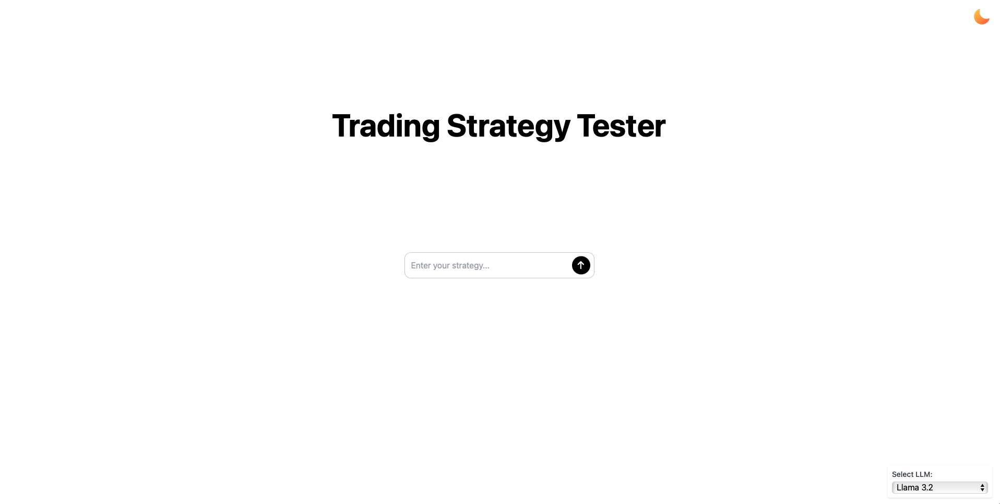
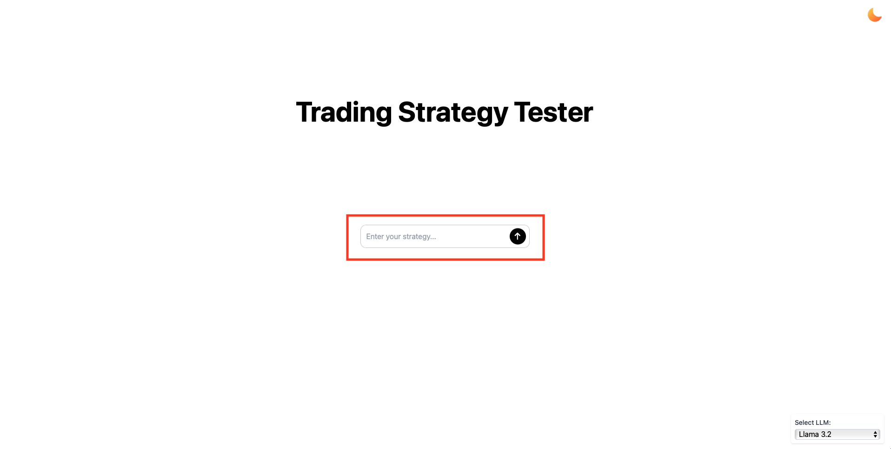
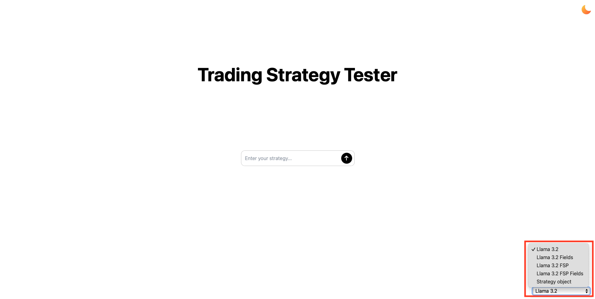
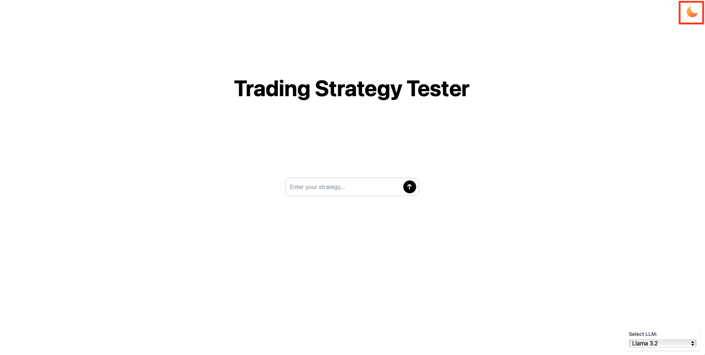
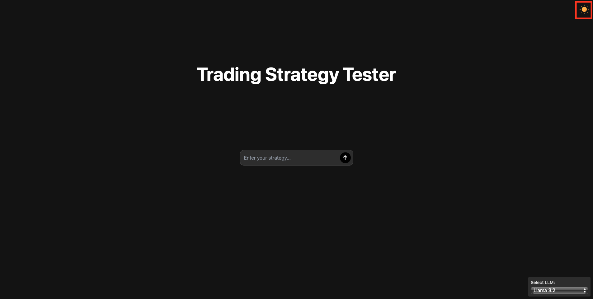

# Web UI

If you want to use `Trading Strategy Tester` web UI, you can find the installation instructions in the [Administrator Documentation](../../admin/index.md#web-application). The web UI is a separate project that uses `Trading Strategy Tester` package as a backend. You can find the repository [here](https://github.com/DrDanicka/trading_strategy_tester_web_app).

## Main Page

When you open the web UI, you will see the main page which looks like this and consists of several sections:



### Prompt Section

This is the main text area in the middle of the page where you can insert your prompt. It's located in the red rectangle in the next image:



After you inserted your prompt you can click the button next to the text area to process the prompt, or you can press `Enter` key on your keyboard.


### Select Model Section

In the right bottom corner of the page you can see the `Select LLM` section. This is where you can select which model and approach you want to use for processing your prompt.



You can choose between:
- **Llama 3.2**:  
  This is a fine-tuned `Llama 3.2 3B` model that generates the whole `Strategy` object from the prompt.

- **Llama 3.2 Fields**:  
  These are fine-tuned `Llama 3.2` models that generate the fields of the `Strategy` object from the prompt. After generating the fields separately, the `Strategy` object is created from them. All the fields except `conditions` are generated using the `Llama 3.2 1B` model. The `conditions` field is generated using the `Llama 3.2 3B` model.

- **Llama 3.2 FSP**:  
  This is a `Llama 3.2 3B` model that uses few-shot prompting to generate the `Strategy` object from the prompt. This model creates the whole `Strategy` object directly.

- **Llama 3.2 FSP Fields**:  
  These are `Llama 3.2 3B` models that use few-shot prompting to generate the fields of the `Strategy` object from prompts. After generating the fields separately, the `Strategy` object is created from them.

- **Strategy object**:  
  Here, the user can submit the `Strategy` object directly as Python code. It should be valid Python code that creates the `Strategy` object, and **all the parameters should be named correctly** except for three exceptions:

    - The `ticker` parameter in `TradingSeries` objects should not be named. For example: do not use `RSI(ticker='AAPL', length=14)`; the correct way is `RSI('AAPL', length=14)`.

    - The same rule applies to the `const_number` parameter in `CONST` `TradingSeries`. Do not use `CONST(const_number=30)`; the correct way is `CONST(30)`.

    - Do not name `year`, `month`, `day` in the `datetime` object. For example: do not use `datetime(year=2015, month=1, day=1)`; the correct way is `datetime(2015, 1, 1)`.

  Here is an example of how valid `Strategy` object looks like:

```python
Strategy(
    ticker="AAPL",
    position_type= PositionTypeEnum.LONG_SHORT_COMBINED,
    buy_condition= CrossOverCondition(
        first_series=RSI('AAPL', length=14),
        second_series=CONST(30)
    ),
    sell_condition=CrossUnderCondition(
        first_series=RSI('AAPL'),
        second_series=CONST(70)
    ),
    start_date=datetime(2015, 1, 1),
    end_date=datetime(2020, 1, 1),
    order_size=Contracts(value=1)
)
```

If you want to learn more about `Strategy` object structure, you can check the [Strategy documentation](../../dev/modules/strategy.md) and if you want to learn more about how to write prompts for LLMs, you can check manual at [How to write prompts](../../llm/how_to_write_prompt.md).

### Light/Dark Mode

In the right top corner of the page you can see the `Dark Mode` button. 





This button allows you to switch between light and dark mode.

Once you submit the prompt, the web UI will process it and display the results in the `Result` section. To learn more about the results, check the [Strategy results](strategy_results.md).