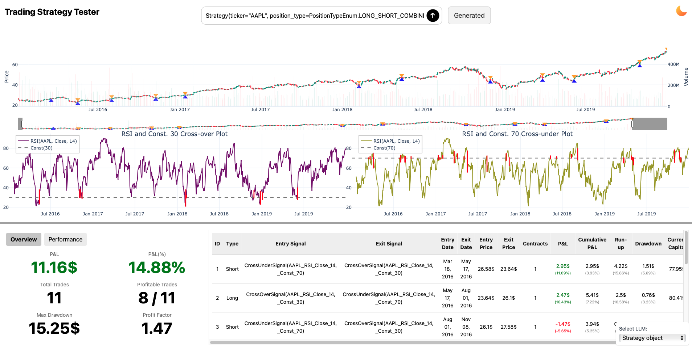
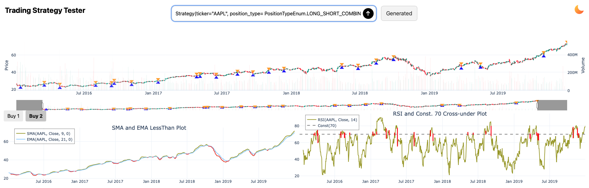
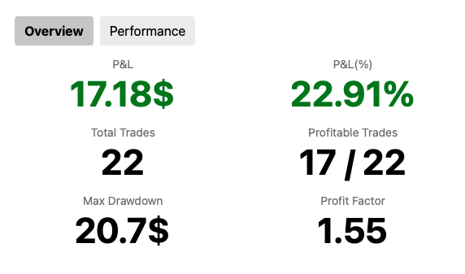
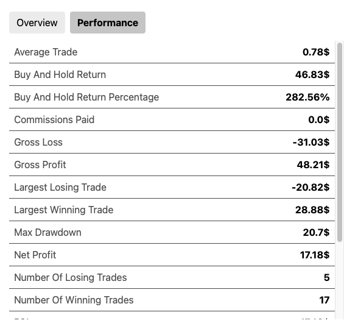
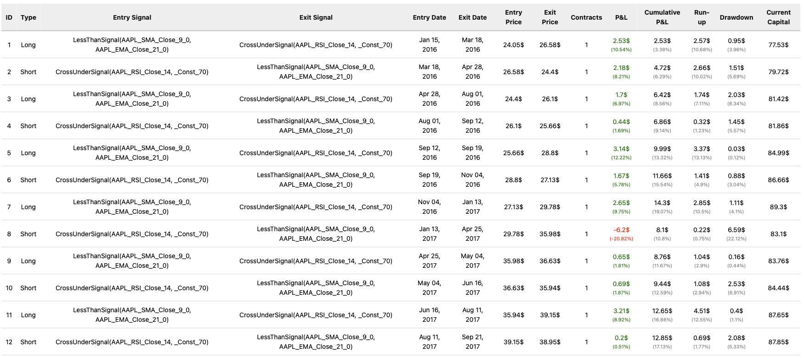

# Strategy results

Once your strategy is executed, you can view the results in the web application. The results are separated into three sections: [`Graphs`](#graphs), [`Statistics`](#statistics), and [`Trades`](#trades). The results screen looks like this:



Before we dive into the details of each section, let's talk about the `Generated` button next to the prompt window that appears after you submit the prompt.

After every prompt is submitted it is processed by the LLM that creates the `Strategy` object. After LLM generates the `Strategy` it goes through the validation process. The validation process checks if the `Strategy` object is valid and if it is not it can fix some issues or use default values. After the `Strategy` object is valid it is executed and the strategy that gets executed is hidden under the `Generated` button. If you hover over the `Generated` button, you will see the generated `Strategy` object. And if you hover over `Generated` button it changes to `Copy` and you can copy the generated `Strategy` object to the clipboard. This way you can see what the LLM generated and if you are not satisfied with the generated `Strategy` object you can modify it and submit it again as `Strategy object`.

If the `Strategy` object generated by the LLM is not valid there are two scenarios that can happen:

1. The validator can fix the issues and generate a valid `Strategy` object. In this case there will be new button next to `Generated` button that says `Changes`. If you hover over the `Changes` button, you will see the changes that were made to the `Strategy` object.
2. The validator cannot fix the issues and the `Strategy` object is not valid. In this case you will still be able to see the generated `Strategy` object but you will not be able to execute it. You will get an error box with the message of what went wrong when validating the `Strategy` object.

Let's take a look at the three sections of the results screen.

## Graphs

The `Graphs` section displays the graphs generated by the strategy.



Graph section is divided into three parts.

1. **Price**: This graph shows the price of the ticker, volume, and entry and exit points of the strategy. The entry points are marked with blue triangles and the exit points are marked with orange triangles. The volume is shown as a bar graph below the price graph. On the left side of the price graph is the scale of the price and on the right side is the scale of the volume. Thanks to `Plotly` library you can zoom in and out of the graph and hover over the points to see the exact values.
2. **Buy**: This section is always bottom left from the price graph. It shows the buy signals generated by the strategy for each condition. If there are multiple conditions with their own `TradingSeries`, the graphs are separated and you can click between them by clicking `Buy n` button where `n` is the number of the condition.
3. **Sell**: This section is always bottom right from the price graph. It shows the sell signals generated by the strategy for each condition. If there are multiple conditions with their own `TradingSeries`, the graphs are separated and you can click between them by clicking `Sell n` button where `n` is the number of the condition.

Not all the conditions generate graphs. If there is no graph for either section `Buy` or `Sell` the bottom section will be taken by the one where there are graphs. For example if there are no graphs for `Buy` section, the `Sell` section will take the whole bottom part of the screen and the `Buy` section will not be shown. And if there are no graphs for both sections, price graph will take the whole graph section.

Under the `Graphs` section there is a divider that separates the graphs from the `Statistics` and `Trades` sections. The divider is a horizontal line that can be moved up and down to adjust the size of the graphs section.

## Statistics

The `Statistics` section is in the bottom left corner of the screen. It is divided into two parts that can be switched between by buttons. The sections are:

**Overview**:



**Performance**:



In the `Overview` section you can see the most important statistics about the strategy. The statistics are: 

- **Profit and Loss and Profit and Loss percentage**
- **Number of all trades and number of winning trades**
- **Maximum drawdown**
- **Profit factor**

In the `Performance` section you can see the performance of the strategy which is basically more detailed statistics about the strategy. The statistics that are different from the `Overview` section are:

- **Average profit per trade**
- **Buy and hold return and percentage**
- **Commissions paid**
- **Gross profit and loss**
- **Largest winning and losing trades**
- **Net profit**
- **Number of winning and losing trades**
- **Sharpe ratio**

## Trades

The last section is the `Trades` section. It is in the bottom right corner of the screen. 



It shows the trades generated by the strategy. The trades are shown in a table with the following columns:

- **ID**
- **Entry signal**
- **Exit signal**
- **Entry date**
- **Exit date**
- **Entry price**
- **Exit price**
- **Number of contracts**
- **Profit and Loss**
- **Cumulative profit and loss**
- **Run up**
- **Drawdown**
- **Current capital**

In the Entry and Exit Signals there is always a condition that triggered the signal. Then there are `TradingSeries` in each of the conditions that have the following format:

```python
Ticker_TradingSeriesName_TradingSeriesParameters
```

So for example for `RSI` `TradingSeries` with source series the `Close` price and`length=14` the format would be:

```python
RSI_AAPL_Close_14
```

If no parameters were specified the default ones are used. You can see the parameters of each `TradingSeries` in the [TradingSeries section](../../dev/modules/trading_series.md) of the documentation.